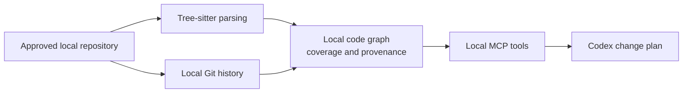

# CodebaseCartographer

> Give Codex local evidence before it changes unfamiliar code.

`Python 3.11+` | `Codex MCP plugin` | `Local static analysis` | `MIT`

CodebaseCartographer is a local MCP server for understanding a repository before planning a change. It parses supported source files, builds a graph of modules, classes, functions, imports, and calls, and adds local Git context when it is available. Codex uses those structured results to explain what is known, what is inferred, and what still needs validation.

## Why use it

Use it when you need a reliable starting point for an unfamiliar codebase:

- **Plan a change safely.** Trace static callers, callees, imports, and likely blast radius before editing a function or module.
- **Onboard faster.** Find architecture, important modules, ownership, hotspots, and dependency boundaries without reading every file first.
- **Make evidence-based decisions.** Ask Codex for verified facts, inferences, unknowns, and recommended tests instead of a confident guess from flat source text.

It never executes the repository it analyzes. Parsing, graph construction, Git inspection, and cache handling happen on your machine.

## How it works



The graph is static evidence, not runtime proof. If a relationship is unresolved or ambiguous, the tool reports that rather than inventing an edge.

## Install in Codex

### 1. Install the local runtime

You need Python 3.11+ and `pipx`. If `pipx` is not already installed:

```bash
python -m pip install --user pipx
python -m pipx ensurepath
```

Open a new terminal, then install CodebaseCartographer and confirm that its MCP launcher is available:

```bash
pipx install "git+https://github.com/vikky781/codebase-cartographer.git"
python -c "import shutil; assert shutil.which('cartographer-mcp'), 'cartographer-mcp is not on PATH'"
```

### 2. Install the Codex plugin

```bash
codex plugin marketplace add vikky781/codebase-cartographer --ref main
codex plugin marketplace list
```

Restart the ChatGPT/Codex desktop app. Open **Plugins**, select **Codebase Cartographer Local**, and install `codebase-cartographer`.

If Codex cannot find `cartographer-mcp`, use the absolute path to the installed launcher. See [Local MCP setup and troubleshooting](docs/LOCAL_MCP.md).

## Your first analysis

Open a fresh Codex task for the repository you want to inspect, then send a prompt like this:

```text
Use CodebaseCartographer to analyze this repository:
C:\absolute\path\to\my-repository

First summarize coverage and warnings. Then explain the architecture,
the most important modules, and what I should inspect before making changes.
```

`analyze_repo` must run first in each new server session. Re-run it after meaningful repository changes so Codex is working from current evidence.

For a large repository, start with the subsystem you intend to change:

```text
Analyze C:\absolute\path\to\my-repository with scope "src/payments".
Clearly label the result as partial and do not infer facts about files outside that scope.
```

`scope` is intentionally conservative: a scoped result sets `is_partial`, and unscanned files can change the conclusion.

## Common workflows

| Goal | Ask Codex |
| --- | --- |
| Understand a codebase | "Analyze this repository, summarize its architecture, and identify the modules I should learn first." |
| Change a function safely | "Before changing `PaymentService.process_refund`, trace callers and callees, identify affected modules, Git context, unknowns, and tests I should run." |
| Investigate a failure | "Search for `InvalidStateError`, trace the surrounding flow in both directions, and show the most likely local modules to inspect." |
| Find design risk | "Find cycle, coupling, bottleneck, and orphan-file candidates. Separate static candidates from facts that require runtime validation." |
| Understand ownership | "Show Git context for `src/payments/service.py`: authors, recent commits, and frequently co-changed files." |

## What the tools provide

| Tool | What it helps answer |
| --- | --- |
| `analyze_repo` | What was analyzed, what evidence was found, and how complete it is. Call this first. |
| `search_graph` | Where a function, class, or module lives and its immediate graph neighbors. |
| `trace_flow` | What a local entity calls, what calls it, and the source/provenance of each edge. |
| `find_issues` | Static candidates for cycles, unused code, god classes, bottlenecks, orphan files, and coupling. |
| `get_metrics` | Structural importance, centrality, static line span, Git hotspots, coupling, and ownership. |
| `visualize` | Mermaid architecture, dependency, layer, call-flow, and Git-backed hotspot diagrams. |
| `get_git_context` | Local authorship, commit history, file age, and co-change context. |

## Supported analysis

| Files | Support | Important boundary |
| --- | --- | --- |
| Python (`.py`) | Deep Tree-sitter parsing, entities, imports, and conservative local call resolution | Dynamic dispatch and framework wiring can still be missed. |
| JavaScript, TypeScript, TSX | Tree-sitter parsing and conservative ES-module call/import evidence | CommonJS, dynamic module loading, decorators, and injection are not fully resolved. |
| Java, Go, Rust, Ruby, PHP, C/C++, C#, Swift, Kotlin, Scala | Regex-based declaration/import inventory | No dependable call graph; treat it as an exploratory index only. |

`complexity` currently means static line span for Tree-sitter entities. It is not cyclomatic complexity and should not be treated as a defect-risk score.

## Read the evidence correctly

- **`unresolved` or `ambiguous` does not mean absent.** It means the static analyzer could not prove one local target.
- **Issue findings are candidates.** Validate framework routes, reflection, callbacks, generated code, runtime configuration, and plugin wiring.
- **Git context depends on local history.** A shallow clone cannot provide meaningful ownership or long-term co-change evidence.
- **Partial scans are partial.** Use `analysis_scope`, `is_partial`, `coverage`, and `warnings` before making a decision.

## Privacy and local behavior

- The server parses source, inspects Git, and constructs its graph locally.
- It does not execute the analyzed repository or make application-level API calls.
- Its default cache is `.cartographer_cache/` inside the approved repository. Use `use_cache=false` through MCP or `--no-cache` through the CLI to avoid cache reads and writes.
- Tool results may enter the selected MCP host/model context. Review that host's data settings before analyzing sensitive code.

## Optional: try it from the terminal

The same engine is available without a Codex client:

```bash
cartographer analyze /absolute/path/to/repository --scope src --no-cache
```

For a safe local demonstration:

```bash
git clone https://github.com/vikky781/codebase-cartographer.git
cd codebase-cartographer
python -m pip install -e ".[dev]"
python -m codebase_cartographer.cli analyze "$(pwd)/fixtures/sample_repo" --no-cache
```

On Windows PowerShell, replace `$(pwd)` with `$repo = (Get-Location).Path` and use `"$repo\fixtures\sample_repo"`.

## More documentation

- [Local MCP setup and troubleshooting](docs/LOCAL_MCP.md)
- [Contributor guide](CONTRIBUTING.md)
- [Security policy](SECURITY.md)
- [Hackathon demo and submission material](HACKATHON.md)

CodebaseCartographer is released under the [MIT License](LICENSE).
